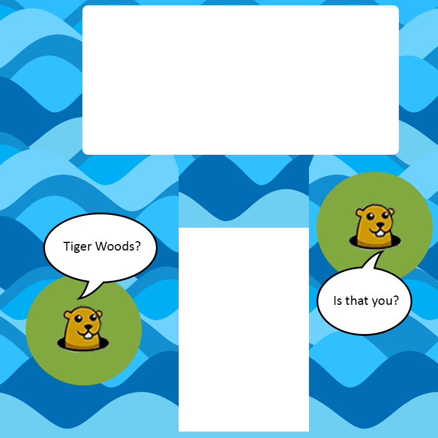

# Game Design Document

## Overview
The game is a 3-hole 2-D mini-golf game with several obstacles. The user must hit a golf ball to navigate through these obstacles and collect points along the way. These obstacles may include moving blockades, a moving golf hole, menacing gophers, water hazards, and sand bunkers. 

## The Objects
**1. Moving Blocks:** These objects are moving tiles that disrupt the movement of the golf ball if struck. These make it difficult for the user by diverting the golf ball away from the intended direction. These will be represented by specific rectangle objects of different sizes. As time progresses in later levels, these blocks will increase in size and speed to make it even more difficult.

**2. Golf Hole:** There is one golf hole per hole and in each level the golf hole will move randomly in a given area. The user must make the golf ball touch the hole to complete the level. 

**3. Water Hazards:** Water hazards will exist on every hole and they do not move. If the user hits his golf ball into the water, he loses a golf ball. 

**4. Barges: ** A Barge will exist only on level 3 to transport the ball across the water. 

**5. Stars:** Stars move around the course randomly and if the ball hits a star, the user receives points. They do not affect the velocity of the ball.

**6. Gophers:** Gophers move around the course. If the ball touches a gopher, the user loses a ball. As time progresses in a level, more gophers will pop up (and they will move faster), making it more difficult for the user to score. The gopher will look something like the following image: 

**7. Course:** The course is a non moving object that represents the layout of each hole. 

**8. Arrow:** The arrow is controlled by the user to determine the aim of the golf ball.

**9. Golf Ball:** The golf ball moves around based on the power and the aim

### Other Elements
**1. Start Button** Starts the game

**2. Quit Button** Closes the game

**3. Stroke/Lives/Points Counters** These counters will be LCDNumber objects displayed on the right hand side.

**4. Power Slider** The power slider is used to set the power for every shot.

## Gameplay
The user's objective is to complete each hole, accumulating as many points as possible, while minimizing his or her strokes and time used. Each stroke begins with the player setting his or her aim and power. Aim is set using the A and D  keys, and power is set a slider. After this, the user must hit the space bar to execute the shot. The golf ball will then travel the golf course based on the power/aim and settle in a location. The arrow for aim will always be displayed behind the golf ball at the beginning of each stroke. The user will continue to play until his golf ball touches the hole. There are 3 holes to navigate.

## Scoring
Scoring is based on 2 things: 1) The number of strokes 2)  Stars collected along the way are worth 500 points each. The par for the entire course is 20. A 20 will receive 1000 points, and any stroke under will receive an additional 1000. Each stroke over equals a deduction of 250. You cannot get below a 0.

A player also has 5 golf balls to complete the game. Each time he or she hits a gopher or into a water hazard, a golf ball is lost. If the user loses all of his or her golf balls he or she will get a 0. 

## Game Layout

