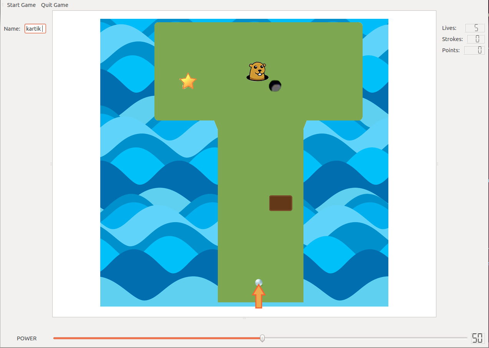

# Game - Programming Assignments Private Repository
### Student Information
  + Name: Tommy Trojan
  + USC Email: ttrojan@usc.edu
  + USC ID: 0123456789

### Game Information
  + Game Name: myAwsomeGame
  + Game Description: One sentence game description
  + [Game Design Doc](GameDesignDoc.md)


### Compile & Run Instructions
The grader should use the following procedure to compile and run the code:
```shell
#Compile Instructions
qmake -project
qmake
make
#Doxygen Instructions
doxygen -g config.txt
doxygen config.txt
#Command to run
./game_chillaka
```

### Screenshots




